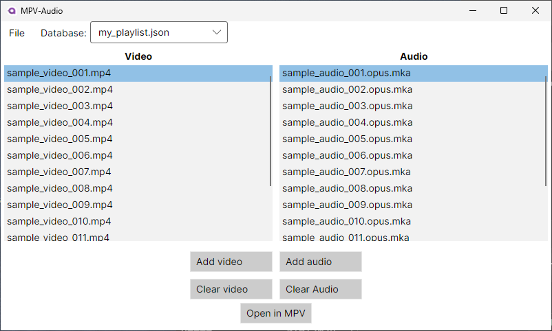

# MPV External Audio Manager

A lightweight desktop application for managing external audio tracks with MPV media player.

## Features

- 🎵 **Easy Audio Management**: Quickly attach external audio tracks to your video playback
- ⚡ **MPV Integration**: Seamlessly works with your existing MPV installation
- 📁 **File Organization**: Save and load audio track configurations for repeated use

## Usage
1. Add MPV to PATH or set a full path in config (%APPDATA%\mpv-audio) after the first launch of software
2. Run & Enjoy!

## Installation
### Windows
1. Download the latest release from [Releases Page](https://github.com/regularentropy/mpv_audio)
2. Ensure MPV is installed and is in your system PATH
3. Unzip & run the executable. 

### License
All Rights Reserved © [2025] regularentropy